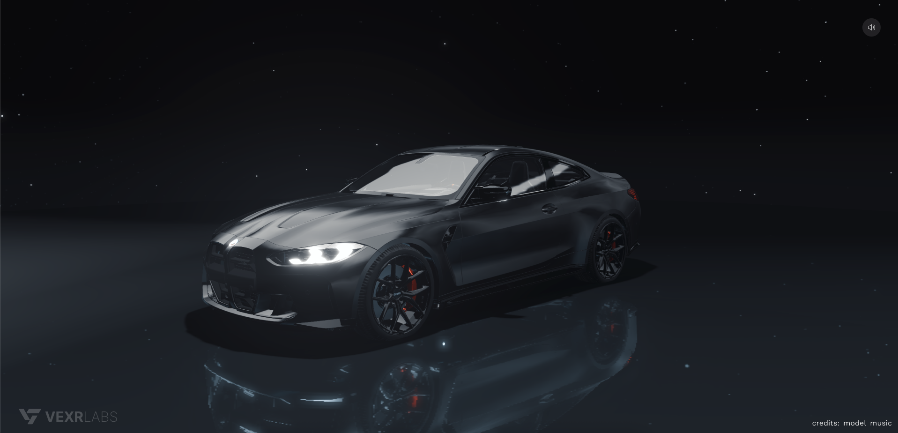
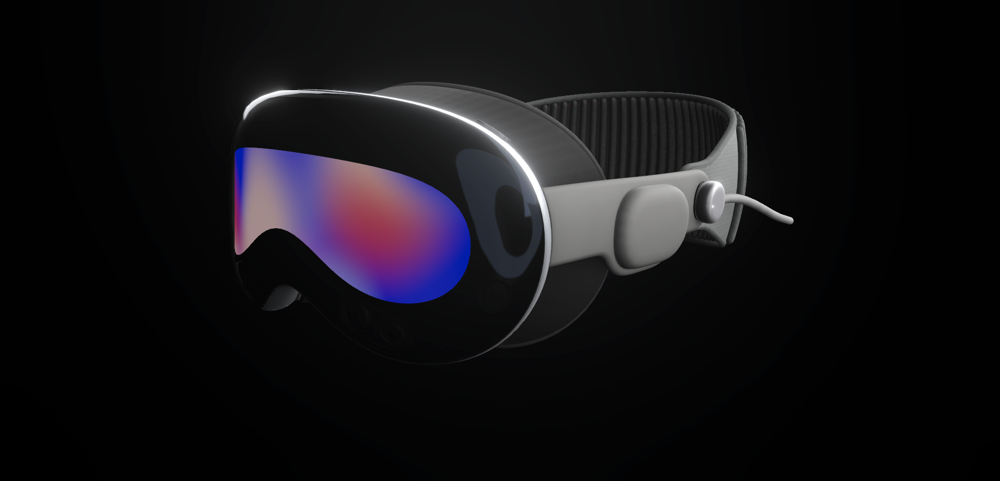

## VXEngine

Create, animate and ship high-end 3D experiences using React. VXEngine combines the power of React Three Fiber with a professional timeline editor and a WASM-accelerated Animation Engine, letting you animate any property with precise keyframe control and performance.

🚀 **[Live Demo](https://vxengine-demo.vercel.app/)**


### Core Systems

#### Studio (VXStudio)
Professional timeline editor for any animatable property. Keyframe everything from transforms to material properties with Bezier curves and live preview.

#### Objects (VXObject)
Build scenes declaratively using React components (`<vx.mesh>`, `<vx.light>`, `<vx.scene>`, `<vx.environment>`).

Minimal scene:

```tsx
<VXRenderer>
  <vx.scene vxkey="scene">
    <vx.mesh vxkey="box" />
    <vx.spotLight vxkey="key" />
  </vx.scene>
  {/* children... */}
  {children}
</VXRenderer>
```

Extend any component for timeline/animation support using the `withVX` HOC:

```tsx
import { withVX } from '@vexr-labs/vxengine'

const MyMesh = (props: any) => <mesh {...props} />
const AnimatedMesh = withVX(MyMesh, { type: 'entity', settings: {} })

// Now addressable in the editor and timeline
<AnimatedMesh vxkey="heroMesh" />
```

#### Engine (AnimationEngine)
WASM‑accelerated Bezier interpolation for numeric tracks. Manages property setters, object lifecycle, and precise timeline control (play/pause/seek).

#### Renderer (VXRenderer)
Optimized Three.js canvas with post‑processing pipeline. Automatic scene/camera/effects setup and development utilities.

### Examples



**[BMW M4 Experience](https://m4-experience.vercel.app/)**



**[Vision Pro Experience](https://vxengine-vision-pro-experience.vercel.app/)**

### Quick start

1) Install package

```bash
npm install @vexr-labs/vxengine
```

2) Install peer dependencies

```bash
npm install react@19.0.0 react-dom@19.0.0 @react-three/fiber @react-three/drei three zustand
```

3) Create a vxengine_animations.json file in your root
This file defines your project's timelines, keyframes, and animation data.
Ensure the timeline id you select in code exists in the JSON.

```json
{
  "projectName": "MyProject",
  "timelines": {
    "demoTimeline": {
      "length": 10,
      "objects": [],
      "splines": []
    }
  }
}
```

4) Minimal usage example:

```tsx
import { VXEngineProvider, VXStudio, VXRenderer, vxengine } from '@vexr-labs/vxengine'
import animations from './vxengine_animations.json'

vxengine
  .initialize('development')
  .loadProject(animations as any, 'MyProject')
  .setCurrentTimeline('demoTimeline')

export default function Layout({ children }: { children: React.ReactNode }) {
  return (
    <VXEngineProvider animations_json={animations as any}>
      <VXStudio />
      <VXRenderer
        canvasProps={{ dpr: [1.0, 1.0], frameloop: 'always', shadows: true }}
      >
        {children}
      </VXRenderer>
    </VXEngineProvider>
  )
}
```

### Tech stack

- React 19, React Three Fiber, Three.js, Drei, Zustand
- Post‑processing, GLSL pipeline, meshline
- Vite/webpack build, TypeScript, Tailwind/Radix UI components

### Notes

- This repository includes private/proprietary engine code intended for licensed/internal use.